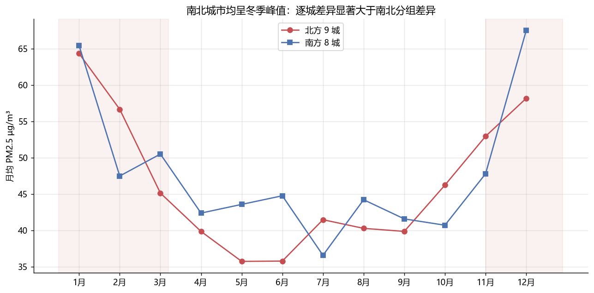

# 中国 17 城空气质量分析：当数据推翻了预设叙事

采集 17 个城市 2022-2024 年逐小时 PM2.5/PM10（CAMS 再分析，Open-Meteo
Air Quality API），聚合为 14,977 个城市-日记录。这个项目最有价值的部分：
**数据推翻了我在写代码前预设的结论**，而仓库如实保留了被推翻的过程。

## 数据来源与采集

- Open-Meteo Air Quality API（CAMS 全球再分析），逐小时 PM2.5/PM10；
- 17 城（北方 9 城 / 南方 8 城）× 2022-08 ~ 2024-12（有效数据段 881 天）；
- 3 秒限速 + 429 退避 + 磁盘缓存；日均聚合要求当日有效小时数 ≥12。

## 发现

1. **冬季峰值是普遍现象**：北方采暖季 vs 非采暖季 Mann-Whitney
   p=6.9e-77（冬 55.5 / 夏 40.3 µg/m³）；南方同样 p=1.1e-79
   （冬 56.3 / 夏 42.0）——南北都有显著冬季峰值；
2. **但"北方采暖更糟"的二分叙事不成立**：逐城冬夏比值最高的是兰州 1.83，
   重庆 1.78、深圳 1.78（南方）紧随其后；而北方的沈阳只有 0.98
   （冬季反而低于夏季）。逐城差异远大于南北分组差异；
3. 17 城年均 PM2.5 **全部超过** WHO 日均指导值（15 µg/m³），
   超标天数占比最高的西安达 100%，最低的哈尔滨也有 71%；
4. 年均排名：北京 75.2 最高，哈尔滨 24.8 最低（CAMS 再分析口径）。



## 局限（重要）

- PM2.5 是 CAMS **再分析估计值**而非地面站点实测，绝对量级有系统偏差
  （如北京 75.2 高于公开实测年报口径），**趋势与相对比较可信，绝对值慎用**；
- 城市坐标为市中心单点，不代表全市；有效数据自 2022-08 起（API 归档边界）。

## 复现

```bash
python collect.py    # 约 1 分钟（限速），缓存后秒级
python analyze.py
```
