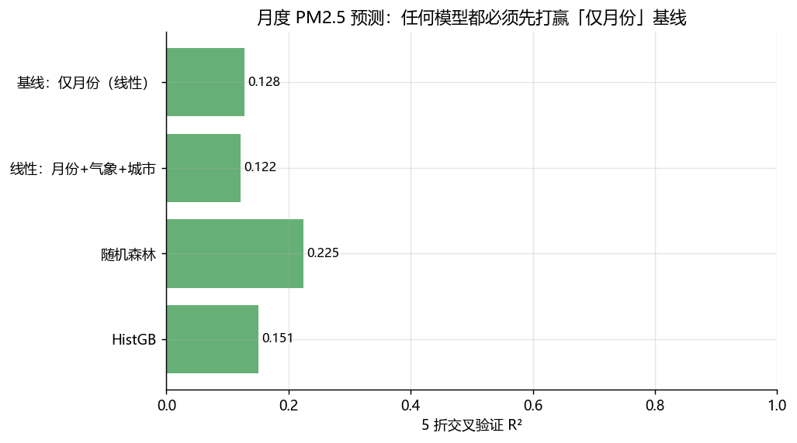
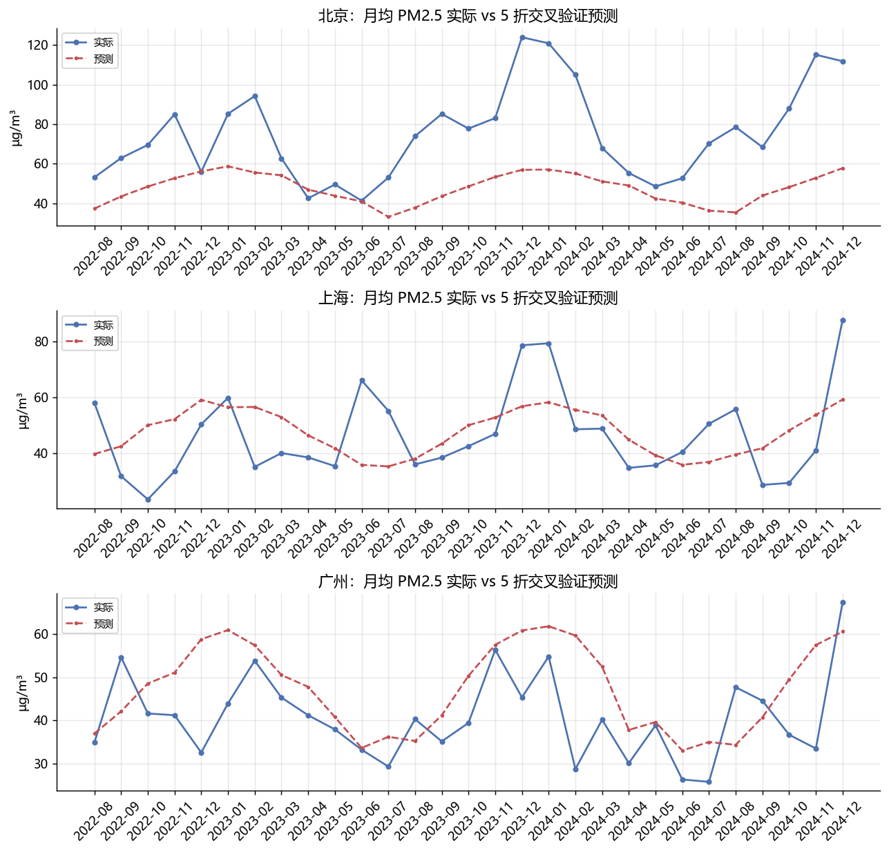

# 监督学习回归：预测城市月度 PM2.5

合并项目一（气象采集）与项目二（空气质量采集）的真实数据，做回归任务。
这个项目的核心不是"R² 多高"，而是**两次如实的任务口径修正**——
多数教程不会告诉你这两步。

## 两次口径修正（真实过程）

**第一次：日度 → 月度。** 最初直接预测"某天某城"的 PM2.5，时间外推
R² 只有 ≈0.1。诊断后明白：日度 PM2.5 的方差主要来自逐日天气噪声，
季节与城市可解释的部分不足 20%——**日度口径的天花板就在那里**，
聚合到城市-月粒度（377 个样本）才是正确的建模决策。

**第二次：发现朴素基线的分量。** 仅用"月份周期编码"两个特征的线性模型
R²=0.128——季节性 alone 解释了 13% 的方差。任何模型都必须先打赢它。

## 最终结果（5 折交叉验证，377 个城市-月）

| 模型 | R² | MAE (µg/m³) |
|---|---|---|
| 基线：仅月份周期（线性） | 0.128 | 15.04 |
| 线性：月份+气象+城市 | 0.122（-1pp） | 15.06 |
| **随机森林（月份+气象+城市）** | **0.225（+10pp）** | **13.66** |
| HistGB | 0.151（+2pp） | 14.68 |

## 结论

1. **季节性是月度 PM2.5 的主导可解释因素**（基线 13%）；
2. **城市身份带来 +10pp**——城市间基线水平差异大（24.8 ~ 75.2）；
3. **线性模型加城市哑元反而没赚到**：月份 × 城市的交互（各城季节形态
   不同）线性模型吃不到，树模型自动捕获——这就是为什么随机森林赢；
4. 气象特征（当月均温/降水）贡献有限：它们与月份高度共线，
   是相关性特征而非额外信息。




## 局限

- 这是相关性估计而非因果模型：气温与污染同为季节/天气过程的产物；
- 13 城为两数据源城市交集；CAMS 再分析的绝对量级偏差同样适用；
- 29 个月的样本期内每年只有 1 个冬季观测，年际波动无法建模。

## 复现

```bash
python run_regression.py   # 需要 data/ 下两份采集数据（已随仓库提供）
```
