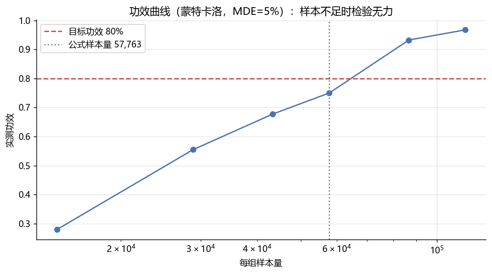

# A/B 测试方法论：样本量公式 × 蒙特卡洛互证

面试统计题的全覆盖实现：**样本量计算 → 蒙特卡洛验证 → 双比例 z 检验全流程
→ A/A 诚实性检查 → 功效曲线**。数据是模拟的（明确标注），方法是工业级的。

## 四个组成部分

**1) 样本量公式**（双比例正态近似）：基线转化率 10%、MDE 相对提升 5%、
α=0.05、power=0.80 → 每组 **57,763** 样本。

**2) 蒙特卡洛互证**：按公式样本量模拟 2000 次有差异实验，实测拒绝率
**80.5%**——与公式目标 80% 吻合。这就是"样本量公式不是玄学"的证据。

**3) 一次完整实验报告**：z=3.32、p=0.00092、相对提升 6.0%、
95% CI [+0.24pp, +0.94pp]（不含 0，与 p 值结论自洽）。

**4) A/A 诚实性检查**：2000 次无差异实验的假阳性率 **5.3%** ≈ α=5%。
若 A/A 假阳性率异常，说明检验实现有 bug——这是 A/B 平台上线前的标准验收。



## 功效曲线的读法

样本量低于公式值时功效急剧衰减（50% 样本 ≈ 50% 功效）；高于公式值后
收益递减。**样本不足时 A/B 检验是"盲人"**——这正是"实验没跑够就宣布
无显著差异"是统计错误的原因。

## 复现

```bash
python ab_simulation.py    # numpy + scipy，约 10 秒
```

## 诚实声明

- 转化数据为模拟生成（随机种子固定），**方法真实、数据非真实**——
  与作品集其他项目的"真实数据"原则在此处的取舍：A/B 方法论的本质是
  统计性质验证，模拟恰是最恰当的数据来源；
- 未含：序贯检验与 peeking 的 α 膨胀、CUPED 方差缩减、多变量校正——
  每一个都是可以继续展开的面试话题。
