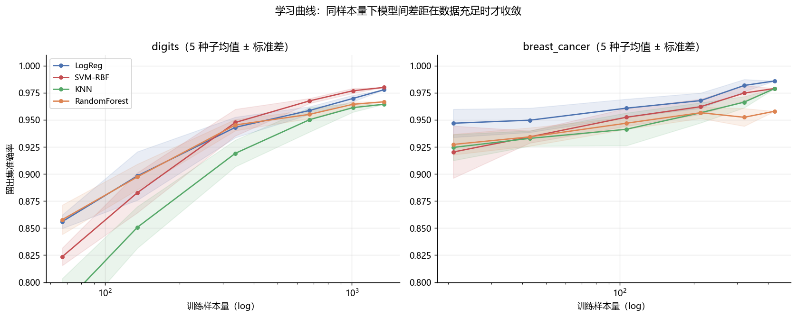

# 学习曲线：到底需要多少数据？

用学习曲线定量回答"需要多少数据"——这是 ml-bench/01 模型对比与
ai-lab/04 深度学习对照实验的 自然延伸。

## 实验设计

- 2 个数据集（digits 1797 样本、breast_cancer 569 样本）×
  4 模型（LogReg/SVM-RBF/KNN/随机森林，与 01 同口径）×
  6 个训练规模（5%~100% 分层子采样）× 5 随机种子；
- 评估固定留出集，报告均值 ± 标准差；
- 全部实测（reports/curves.json 附完整数据）。

## 实测结论

| 数据集 | 模型 | 到达"最终准确率 99%"所需样本 | 最终准确率 |
|---|---|---|---|
| digits | 全部 4 模型 | **1010（全部训练数据）** | 96.4% ~ 98.0% |
| breast_cancer | LogReg | **320（75%）** | 98.6% |
| breast_cancer | RandomForest | 213（50%） | 95.8% |

1. **digits 是"数据饥饿"型**：所有模型都需要全部训练数据才接近收敛——
   这直接解释了 ai-lab/04 里 MLP（94.4%）与 SVM（98.0%）的差距：
   数据不足时深度模型受害更深；
2. **breast_cancer 收敛快得多**：LogReg 用 75% 训练数据即达最终性能的 99%，
   意味着继续采集成收益递减；
3. 曲线形态分两型：LogReg/SVM 平滑爬升（参数化强先验），RF 早期即高但
   后期被树数量主导——曲线形状本身就是模型偏差-方差结构的可视化。



## 复现

```bash
python run_curves.py    # 约 2 分钟（4 模型 × 6 规模 × 5 种子 × 2 数据集）
```
